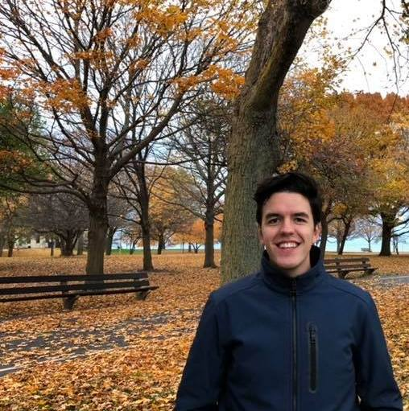

# Computing for the Social Sciences: Homework 1
## Angel Aliseda Alonso 

### Background
My name is Angel Aliseda Alonso, I am a second-year MPP student from Harris School of Public Policy. I was born in Mexico and before coming to the University of Chicago I worked at the Mexican Social Security Institute. My professional interests are __health policy__, __health systems reform__ and __program evaluation__, but I also enjoy running next to Lake Michigan, traveling and food (specially __deserts__).

### Education

* BA in Economics from the Instituto Tecnologico Autonomo de Mexico (ITAM), _2009-2014_
* BA in Political Science from the Instituto Tecnologico Autonomo de Mexico (ITAM), _2009-2014_

### Work Experience

* __Mexican Social Security Institute (IMSS)__
  * _Advisor to the Director of Strategic Planning, 2016-2018_
    * Participated in the impact evaluation of a bed management program at general hospitals by       developing the main impact indicators for the program, composing the dataset from IMSS         hospital’s administrative data, performing the econometric analysis and helping to             elaborate the final impact report
    * Coordinated a 12-person team responsible for implementing a bed management program and a       new post-triage process in emergency departments aimed to increase staff coordination and       reduce waiting time at 180 general hospitals
  
  * _Analyst at the Strategic Research Area, 2014-2016_
    * Collaborated in designing the impact evaluation of a pay-for performance pilot program to       enhance metabolic control of diabetic patients using a randomized controlled trial by          developing some evaluation instruments and analyzing the baseline data used for the            randomization process
    
* __Instituto Tecnológico Autónomo De México (ITAM)__
  * _Research Assistant at the Department of Political Science, 2013-2014_
    * Collaborated in the impact evaluation of “Jóvenes con Porvenir,” a training program            targeted to unemployed youth of municipalities of the Mexican state of Jalisco, by             compiling the dataset and performing the initial statistical analysis
    
You can find more information about me in [LinkedIn](https://www.linkedin.com/in/angel-aliseda-alonso-06a7aa74/)

### Pictures

