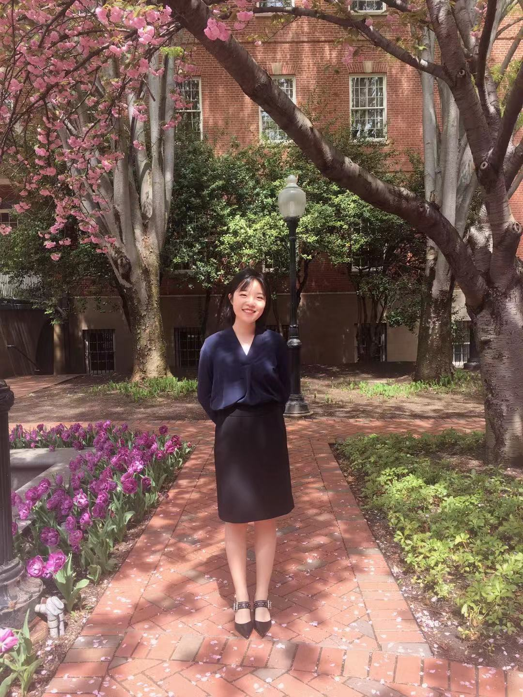

# hw01

# Hello！

## Brief Intro
My name is **Joanna Zhang**. I'm a MAPSS student with an economics concentration. I spent my undergrad years at Oberlin College. This is my first year at UChicago so I'm very excited about meeting new people! You can find my LinkedIn page [here](https://www.linkedin.com/in/jiahang-zhang-aa858113b/).

## Research Interests
I am interested in the global financial markets. Specifically....

* Asset Pricing 
* Emerging Markets
* Blockchain & Cryptocurrency
We can talk if you're interested in one of those!

And finally a picture of me. 
