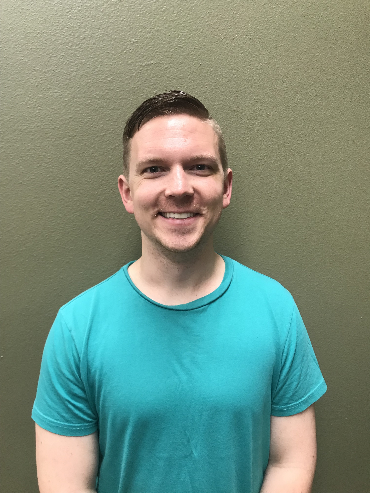

# Homework #1
##### by
### David Johnson

Hello world!

I am David, a MAPSS student looking to concentrate in Comparative Human Development, and even **more** specifically than that, adolescent development.
I am originally from [Florida](https://time.com/4214021/florida-man-throws-alligator-into-wendys-drive-thru-window/), went to school in Tennessee - just not *at* Tennessee ([hint](https://www.espn.com/college-football/recap?gameId=333272633)), and have been living in [California](https://www.youtube.com/watch?v=uqSKl7sdUa8) for the past 4 years.

#### Things I Like
* Improv comedy
* Cats
* Learning to code
* Donating hair! Here is an 'after' photo I took last January:

To see the 'before' photo, click [here](Before_Haircut_Rotated.jpg)!

I have really been enjoying this course thus far, and also whenever I think of coding I think of [this hilarious website](www.hackertyper.net).

Cheers!

David
