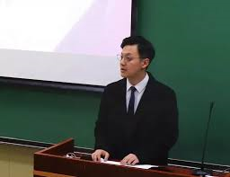

# A Profile of Yanchi Liu
## Introduction
Hi, everyone. This is Yanchi Liu, a current student in MAPSS Econ. I'm from Chengdu, China, a city famous for the hot-pot and pandas (see this [link](https://en.wikipedia.org/wiki/Chengdu) to find more attractive information about Chengdu). This is my first time visiting and living in US and I'm eager to explore the academic life here, as well as the city of Chicago.

## Education
M.A. Candidate, Economics, The University of Chicago, 2019-present.

B.A., Economics, Nankai University, 2019.

## Research Interests
My research interest generally focuses on **International Trade**

1. Measurement and Changes of Export Product Qualities under Trade Liberalization
2. Import Structures and the Influences on Domestic Labor Market

## Hobbies
* Travelling
* Pop Music

## My Photo

